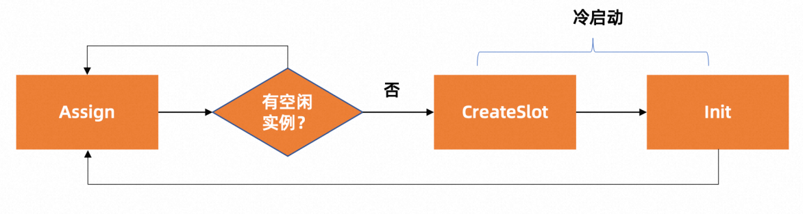

# scaler实现指南

本赛题需要选手实现一个 Scaler 模块的功能。在实际生产环境中一个 Scaler 模块为了实现弹性伸缩的功能，需要解决很多工程问题，而具体的工程问题往往和实际的环境和技术栈相关。所以本赛题通过仿真框架屏蔽了这些因环境而异的繁琐工程细节，选手只聚焦在 Scaler 核心逻辑即可。
在pkg/scheduler/simple.go 基础上实现`Scheduler`接口(pkg/scheduler/interface.go)，确保实现的函数可以完成下述功能:
* Assign:为请求分配一个应用实例，一个应用实例只能被分配给一个请求，如果无应用实例存在则需要冷启动，重新创建一个实例。无论是Kubernetes中Pod 还是 FaaS 函数，应用实例的启动过程都包括两个部分：实例的分配（CreateSlot）以及应用环境初始化（Init）。然后，实例才可以正常的处理请求
  
* Idle:释放请求占用的应用实例，这个实例如果没有被回收， 可以被下次调用请求复用
  

选手可以基于赛题方给出的数据集(data/data_training.tar.gz),解压后进行本地调试。
赛题方同时提供了用于测试选手代码实现效果的镜像(registry.cn-beijing.aliyuncs.com/cloudnative-challenge/simulator:v1.0.0)，已经嵌入了以上训练数据集，选手可以通过以下本地测试方式进行调试。

# scaler本地开发

## 运行环境

linux 运行环境


## 构建二进制

```
# make binary
```

make build 命令会生成一个二进制:scaler, 存放在项目根目录

* scaler 是本次比赛的框架代码，选手可以通过实现根据assign/idle API来实现alloc/release实例的的功能。

## 如何本地测试

### 申请测试集群

选手可以通过登录[阿里云官网](https://free.aliyun.com/?product=9596839&crowd=personal)领取免费的ASK体验集群，选手可以在此集群上进行本地调试。
成功申请集群后，选手需要将集群的kubeconfig文件下载到本地， 并放置在`~/.kube/config`目录下， 以便后续使用kubectl命令进行调试。

### 本地安装kubectl

[安装文档](https://kubernetes.io/zh-cn/docs/tasks/tools/install-kubectl-linux/)

版本要求： v1.26

后续的调试请使用 `kubectl ` 命令进行测试， 例如：

```
kubectl get pod
```

### 构建docker镜像并推送到镜像仓库

#### 使用阿里云ACR服务
阿里云容器镜像服务（简称 ACR）是面向容器镜像、Helm Chart 等符合 OCI 标准的云原生制品安全托管及高效分发平台。
ACR 产品页 ：https://www.aliyun.com/product/acr 。
当前可以免费使用容器镜像服务 ACR 个人版，点击进入 ACR 控制台 https://cr.console.aliyun.com。

#### 生成镜像并推送至镜像仓库
登录ACR镜像仓库
```
docker login --username=xxx registry.cn-shanghai.aliyuncs.com
```
构建镜像并推送至ACR镜像仓库
```
docker buildx build --platform linux/amd64 -t $IMAGE_REPO:$IMAGE_TAG . --push
```
*  IMAGE_REPO指定镜像repo
*  IMAGE_TAG指定镜像tag

比如: 生成镜像registry.cn-shanghai.aliyuncs.com/cloudnative-challenge/scaler:v1.0， 命令如下:
```
docker buildx build --platform linux/amd64 -t registry.cn-shanghai.aliyuncs.com/cloudnative-challenge/scaler:v1.0 . --push
```

### 部署测试job

`kubectl apply -f hack/serverless-simulaion.yaml`

执行后， 会在对应命名空间下生成名为serverless-simulaion 的job对象，该job的pod中包含两个容器， 一个是scaler 的容器， 一个是serverless-simulator 的容器， 可以使用kubectl命令查看:

`kubectl get jobs serverless-simulaion -o yaml`

可以通过 `kubectl logs -f ` 命令查看pod 里两个容器产生的日志，进而进行问题的排查：

```
#查看scaler 容器日志: 
kubectl logs jobs/serverless-simulaion scaler

# 查看simulator 容器日志:
kubectl logs jobs/serverless-simulaion serverless-simulator
```

# 赛题提交说明

https://tianchi.aliyun.com/forum/post/558730

# 注意
项目中的run.sh将作为容器的脚本，选手提交时请不要修改run.sh的内容，否则可能会导致评测失败。