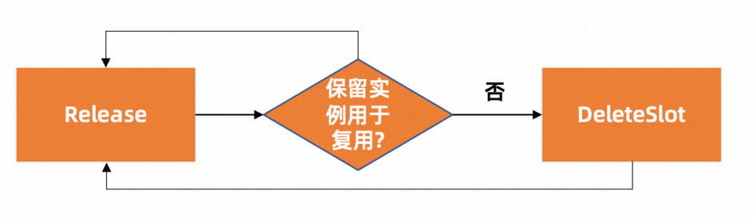

# scaler实现指南

本赛题需要选手实现一个 Scaler 模块的功能。在实际生产环境中一个 Scaler 模块为了实现弹性伸缩的功能，需要解决很多工程问题，而具体的工程问题往往和实际的环境和技术栈相关。所以本赛题通过仿真框架屏蔽了这些因环境而异的繁琐工程细节，选手只聚焦在 Scaler 核心逻辑即可。
本赛题提供了go和java语言的参考实现，选手可以参考其中的任意一种语言实现，也可以自行选择其他语言实现。
这里以go语言为例，选手实现的代码需要实现Scaler接口(go/pkg/scaler/interface.go)，确保实现的函数可以完成下述功能:
在go/pkg/scheduler/simple.go 基础上实现`Scheduler`接口(go/pkg/scheduler/interface.go)，确保实现的函数可以完成下述功能:
* Assign:为请求分配一个应用实例，一个应用实例只能被分配给一个请求，如果无应用实例存在则需要冷启动，重新创建一个实例。无论是Kubernetes中Pod 还是 FaaS 函数，应用实例的启动过程都包括两个部分：实例的分配（CreateSlot）以及应用环境初始化（Init）。然后，实例才可以正常的处理请求
  
* Idle:释放请求占用的应用实例，这个实例如果没有被回收， 可以被下次调用请求复用
  

选手可以基于赛题方给出的数据集(data/data_training.tar.gz),解压后进行本地调试。
赛题方同时提供了用于测试选手代码实现效果的镜像(registry.cn-beijing.aliyuncs.com/cloudnative-challenge/simulator:v1.0.0)，已经嵌入了以上训练数据集，选手可以通过以下本地测试方式进行调试。

## 数据集字段说明
### requests 数据集
requests 数据集包含了一系列的请求记录，每条记录对应一个已经完成的任务。每条记录包含以下字段：

* startTime: 这是一个以毫秒为单位的时间戳，代表任务开始的时间。
* metaKey: 用来标识与任务相关联的元数据，它与元数据数据集中的key字段相对应。
* durationsInMs: 表示任务的执行时间，单位为毫秒。
* statusCode: 表示任务的执行结果。一般来说，200代表任务成功完成，其他值则可能代表有错误或异常情况，模拟的是云计算场景下后端实例偶发性的异常。
### metas 数据集
metas 数据集包含了一系列的元数据记录，每条记录包含一项任务的配置信息。每条记录包含以下字段：

* key: 用来唯一标识一项元数据,可以理解为任务的类型或者特征。它与requests数据集中的metaKey字段相对应。
* runtime: 代表任务需要运行的环境，如python、nodejs、go等。
* memoryInMb: 表示任务需要的内存数量，单位为MB。
* timeoutInSecs: 表示任务的超时时间，单位为秒。
* initDurationInMs: 表示任务初始化的时间，单位为毫秒。

## 接口文档
**注意：以下说明以go语言为例，其他语言请参考对应语言的数据结构定义。**
### Assign 方法
Assign 方法是一个核心接口，其主要目的是分配资源实例以满足任务请求。
Assign方法的核心逻辑可能如下：
1. 解析输入的AssignRequest，提取出元数据信息以及请求时间等。
2. 根据元数据信息以及当前系统的资源状态，决定是否可以分配一个资源实例来执行任务，或者是否需要等待。
3. 如果可以分配，那么创建一个资源实例，记录其创建的时间、类型等信息，并将其标记为已占用状态。
4. 返回创建的资源实例的信息，包括其唯一ID等。
需要注意的是，你也可以在一个AssignRequest到来时创建多个资源实例，如果你预测到后面会有大量同类型的任务到来，这样可以提前创建好资源实例，以便后续的任务可以更快的被分配到资源实例上，减少冷启动时间。
#### 输入
Assign方法接收context和AssignRequest对象作为输入参数。其结构和对应的数据集字段如下：
ctx: context对象，用于跨多个API请求或goroutines之间共享deadline，取消信号，和其他请求范围的值
request: AssignRequest对象，定义了分配请求的所有信息
```go
type AssignRequest struct {
	...
	
    RequestId string `protobuf:"bytes,1,opt,name=request_id,json=requestId,proto3" json:"request_id,omitempty"`
    Timestamp uint64 `protobuf:"varint,2,opt,name=timestamp,proto3" json:"timestamp,omitempty"`
    MetaData  *Meta  `protobuf:"bytes,3,opt,name=meta_data,json=metaData,proto3" json:"meta_data,omitempty"`
}
```
* RequestId: 唯一的请求 ID。
* Timestamp: 时间戳，表示请求发起的时间，对应requests数据集中的startTime 字段。
* MetaData: Meta 对象，包含任务运行所需的元数据信息，对应数据集matas中的字段。

#### 输出
Assign 方法返回一个 AssignReply 对象，包含分配的资源实例的唯一标识。其结构如下：
```go
type AssignReply struct {
    ...

    Status       Status      `protobuf:"varint,1,opt,name=status,proto3,enum=serverless.simulator.Status" json:"status,omitempty"`
    Assigment    *Assignment `protobuf:"bytes,2,opt,name=assigment,proto3" json:"assigment,omitempty"`
    ErrorMessage *string     `protobuf:"bytes,3,opt,name=error_message,json=errorMessage,proto3,oneof" json:"error_message,omitempty"`
}

type Assignment struct {
	...
	
    RequestId  string `protobuf:"bytes,1,opt,name=request_id,json=requestId,proto3" json:"request_id,omitempty"`
    MetaKey    string `protobuf:"bytes,2,opt,name=meta_key,json=metaKey,proto3" json:"meta_key,omitempty"`
    InstanceId string `protobuf:"bytes,3,opt,name=instance_id,json=instanceId,proto3" json:"instance_id,omitempty"`
}
```
* RequestId: 唯一的请求 ID，与输入的 AssignRequest 对象中的 RequestId 字段相同。
* MetaKey: 与输入的 AssignRequest 对象中的 MetaData.Key 字段相同。
* InstanceId: 资源实例的唯一标识，用于后续的 Idle 方法 以及 gc的资源回收。

### Idle 方法
方法用于处理释放实例。你可以设计自己的策略，决定是否删除相应的资源实例。例如，如果短时间内可能会有大量同类型的请求到来，可以保留实例，资源实例将继续用于其他任务，降低冷启动时间；反之，则可能选择将资源实例释放，以节约资源。
#### 输入
Idle 方法接收 context 和 IdleRequest 对象作为输入参数。其结构和对应的数据集字段如下：
```go 
type IdleRequest struct {
	...
    Assigment *Assignment `protobuf:"bytes,1,opt,name=assigment,proto3" json:"assigment,omitempty"`
    Result    *Result     `protobuf:"bytes,2,opt,name=result,proto3" json:"result,omitempty"`
}
``` 
* Assigment: Assignment对象，包含任务的分配信息，对应Assign方法的输出。
* Result: Result 对象，包含任务的结果信息，对应requests数据集中的statusCode和durationsInMs字段
```go
type Result struct {
    ...

	StatusCode   int32   `protobuf:"varint,1,opt,name=status_code,json=statusCode,proto3" json:"status_code,omitempty"`
	DurationInMs uint64  `protobuf:"varint,2,opt,name=duration_in_ms,json=durationInMs,proto3" json:"duration_in_ms,omitempty"`
	NeedDestroy  *bool   `protobuf:"varint,3,opt,name=need_destroy,json=needDestroy,proto3,oneof" json:"need_destroy,omitempty"`
	Reason       *string `protobuf:"bytes,4,opt,name=reason,proto3,oneof" json:"reason,omitempty"`
}
````
* StatusCode: 任务的执行状态码，对应数据集requests中的statusCode字段。
* DurationInMs: 任务的执行时间，对应数据集requests中的durationsInMs字段。
* NeedDestroy: 一个布尔值，表示是否需要释放资源实例。如果为true，则需要释放资源实例；如果为false，则不需要释放资源实例。
* Reason: 释放资源实例的原因。

#### 输出

```go
type IdleReply struct {
    ...

	Status       Status  `protobuf:"varint,1,opt,name=status,proto3,enum=serverless.simulator.Status" json:"status,omitempty"`
	ErrorMessage *string `protobuf:"bytes,3,opt,name=error_message,json=errorMessage,proto3,oneof" json:"error_message,omitempty"`
}
```
* Status: 状态码，表示Idle方法的执行结果。
* ErrorMessage: 错误信息，如果Status不为OK，则ErrorMessage不为空，表示错误信息。

### gcLoop方法
除了上述两个API之外，还有一个gcLoop方法，这个方法是由scaler内部定期调用的，用于回收空闲的资源实例。
gcLoop方法会定期运行，每次运行时，会遍历idleInstances列表，检查每个实例的空闲时间，如果有实例的空闲时间超过了配置的时间IdleDurationBeforeGC，那么这个实例就会被销毁。

在销毁实例时，会调用platformClient的DeleteSlot方法删除这个slot，然后从instances映射和idleInstances列表中删除这个实例，最后会更新实例的状态为deleted。

这个方法的运行时间间隔由Config对象的GcInterval字段控制。
选手可以通过配置GcInterval 和 IdleDurationBeforeGC来控制gcLoop方法的运行频率和空闲实例的回收时间。

# scaler本地开发

## 运行环境

linux 运行环境


## 构建二进制

```
# make binary
```

make build 命令会生成一个二进制:scaler, 存放在项目根目录

* scaler 是本次比赛的框架代码，选手可以通过实现根据assign/idle API来实现alloc/release实例的的功能。

## 如何本地测试

### 申请测试集群

选手可以通过登录[阿里云官网](https://free.aliyun.com/?product=9596839&crowd=personal)领取免费的ASK体验集群，选手可以在此集群上进行本地调试。
成功申请集群后，选手需要将集群的kubeconfig文件下载到本地， 并放置在`~/.kube/config`目录下， 以便后续使用kubectl命令进行调试。

### 本地安装kubectl

[安装文档](https://kubernetes.io/zh-cn/docs/tasks/tools/install-kubectl-linux/)

版本要求： v1.26

后续的调试请使用 `kubectl ` 命令进行测试， 例如：

```
kubectl get pod
```

### 构建docker镜像并推送到镜像仓库

#### 使用阿里云ACR服务
阿里云容器镜像服务（简称 ACR）是面向容器镜像、Helm Chart 等符合 OCI 标准的云原生制品安全托管及高效分发平台。
ACR 产品页 ：https://www.aliyun.com/product/acr 。
当前可以免费使用容器镜像服务 ACR 个人版，点击进入 ACR 控制台 https://cr.console.aliyun.com。

#### 生成镜像并推送至镜像仓库
登录ACR镜像仓库
```
docker login --username=xxx registry.cn-shanghai.aliyuncs.com
```
构建镜像并推送至ACR镜像仓库
```
docker buildx build --platform linux/amd64 -t $IMAGE_REPO:$IMAGE_TAG . --push
```
*  IMAGE_REPO指定镜像repo
*  IMAGE_TAG指定镜像tag

比如: 生成镜像registry.cn-shanghai.aliyuncs.com/cloudnative-challenge/scaler:v1.0， 命令如下:
```
docker buildx build --platform linux/amd64 -t registry.cn-shanghai.aliyuncs.com/cloudnative-challenge/scaler:v1.0 . --push
```

### 部署测试job

`kubectl apply -f hack/serverless-simulation.yaml`

执行后， 会在对应命名空间下生成名为serverless-simulation 的job对象，该job的pod中包含两个容器， 一个是scaler 的容器， 一个是serverless-simulator 的容器， 可以使用kubectl命令查看:

`kubectl get jobs serverless-simulation -o yaml`

可以通过 `kubectl logs -f ` 命令查看pod 里两个容器产生的日志，进而进行问题的排查：

```
#查看scaler 容器日志: 
kubectl logs jobs/serverless-simulation scaler

# 查看simulator 容器日志:
kubectl logs jobs/serverless-simulation serverless-simulator

# 查看当前的数据统计
kubectl exec jobs/serverless-simulation -c scaler -- curl http://127.0.0.1:9000/
```

# 赛题提交说明

https://tianchi.aliyun.com/forum/post/558730

# 注意
项目中的run.sh将作为容器的脚本，选手提交时请不要修改run.sh的内容，否则可能会导致评测失败。